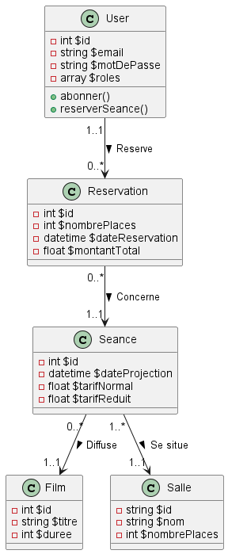

# Api Cinéma
Cette documentation décrit les différentes opérations disponibles via l'API REST développée en Symfony.

## Contexte
* Le cinéma dispose de 5 salles de projection
* Une séance concerne un film (le film est alors à l’affiche)
* Un utilisateur connecté sur le site devra pouvoir réserver des places pour une séance.

## Schéma de la base de données


## Ressources

### Salle
* un id
* un nom
* un nombre de places

### Séance
Une séance concerne la projection d’un film dans une salle.
* un id
* une date de projection (date + heure)
* un tarif normal
* un tarif réduit

### Film

* un id
* un titre
* une durée (en mn)

### User
Un user est une personne connectée au site
* un id
* un username (email)
* un mot de passe
* des rôles

### Réservation
Un utilisateur peut réserver des places pour une seule séance.

* un id
* un nombre de places à réserver
* ne date de réservation (date + heure)
* un montant total

## Endpoints
### Film
* GET /films → 200: Donne une liste de tous les films qui ont une séance prévue dans le futur
* GET /films/{id} → 200: Donne les détails d'un film à l'affiche avec la liste de ses séances

### User
* POST /register → Créer un compte utilisateur avec :
  * Un email associé à un seul et unique Compte
  * Un mot de passe doit contenir :
    * au moins 10 caractères.
    * uniquement des lettres minuscules ou majuscules, des chiffres, ou les symboles suivants : ?;!:=.
    * au moins chiffre.
    * au moins un caractère spécial : ?;!:=.
    * au moins une minuscule.
    * au moins une majuscule.
  * Un mot de passe de confirmation qui doit être égal au mot de passe saisi
```json
{
    "email":"fauxemail@gmail.com",
    "plainPassword":"Motdepasse1!",
    "confirmPassword":"Motdepasse1!"
}
```