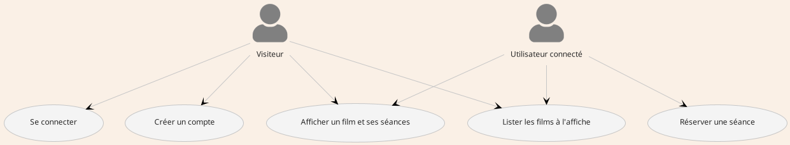
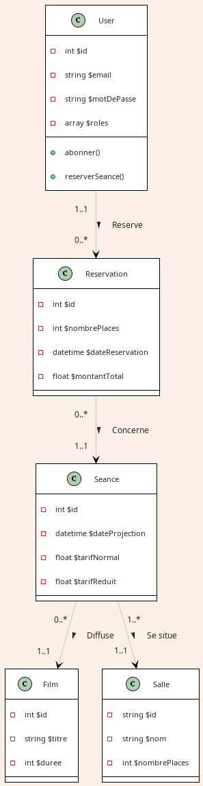

# Super cinoche

La documentation fournit des informations détaillées sur le projet de développement de l'application web de réservation
de séances de cinéma et de son API.

## Cahier des charges

* Le cinéma dispose de 5 salles de projection.
* Chaque salle propose des séances de projection de films.
* Les utilisateurs peuvent réserver des places pour une séance, avec des tarifs normaux ou réduits en fonction de leur
  profil.

### Salle

* un id
* un nom
* un nombre de places

### Séance

Une séance concerne la projection d’un film dans une salle.

* un id
* une date et une heure de projection
* un tarif normal
* un tarif réduit

### Film

* un id
* un titre
* une durée (en minutes)

### User

Un user est une personne connectée au site

* un id
* un username (un email)
* un mot de passe
* des rôles (inscrits, abonnés)

### Réservation

Un utilisateur peut réserver des places pour une seule séance à la fois.

* un id
* un nombre de places à réserver
* une date et une heure de réservation
* un montant total à payer

## Méthodologie et technologies utilisées

### Méthodologie Scrum :

Planification de la réalisation des fonctionnalités sous forme de cycles itératifs.
Utilisation de planificateur de tache en ligne pour organiser la charge de travail.
Revues de projet régulières afin de faire remonter les erreurs et améliorer le produit en continu.

### Technologies :

#### Gestion du projet :

* Outil de planification des taches : Trello, pour répartir la tâche de travail
* Outils de versioning : Git CLI/GitHub

#### Backend (API REST avec Symfony) :

* PHP : langage de programmation utilisé pour développer le backend.
* Framework : PHP Symfony pour exposer les endpoints de l'API REST.
    * ORM : Doctrine (outil de manipulation de bases de données à l'aide d'objet PHP)
    * Outils : Bundle de Symfony pour gérer les requêtes HTTP, les routes de l'application etc...
    * Authentication et gestion des droits : Utilisation de JWT (JSON Web Tokens) avec le bundle PHP nommé "
      LexikJWTAuthenticationBundle"
* Base de données : MariaDB, base de données relationnelle pour stocker les données (salles, séances, films,
  utilisateurs et réservations).
* Créateur de jeu de données : Bundle PHP faker / xylis/faker-cinema-providers
* Gestionnaire de dependence : Composer

#### Frontend (Site web avec Symfony) :

* PHP : langage de programmation utilisé pour développer le backend.
* Framework : PHP Symfony pour gérer les routes.
    * Outils : Bundle de Symfony pour gérer les requêtes HTTP, les routes de l'application etc...
    * Affichage des pages web:
        * moteur de template : Twig, permet d'utiliser un pseudo langage PHP simplifié pour les graphistes
        * languages utilisés : HTML, CSS
        * framework CSS : Bootstrap 4 avec le thème "quartz" (https://bootswatch.com/5/quartz/bootstrap.min.css)
* Gestionnaire de dependence : Composer

## Diagramme des cas d'utilisation



## Schéma de la base de données



## Endpoints

### Film

* GET /films → 200: Donne une liste de tous les films qui ont une ou plusieurs séances prévues dans le futur
* GET /films/{id} → 200: Donne les détails d'un film à l'affiche avec la liste de ses séances

### User

* POST /register → Créer un compte utilisateur avec :
    * Un email associé à un seul et unique Compte
    * Un mot de passe doit contenir :
        * au moins 10 caractères.
        * uniquement des lettres minuscules ou majuscules, des chiffres, ou les symboles suivants : ?;!:=.
        * au moins chiffre.
        * au moins un caractère spécial : ?;!:=.
        * au moins une minuscule.
        * au moins une majuscule.
    * Un mot de passe de confirmation qui doit être égal au mot de passe saisi
    * exemple de données

```json
{
  "email": "fauxemail@gmail.com",
  "plainPassword": "Motdepasse1!",
  "confirmPassword": "Motdepasse1!"
}
```

* POST /login_check → Récupérer son JTW avec :
    * Un email
    * Un mot de passe
    * exemple de données

```json
{
  "username": "fauxemail@gmail.com",
  "password": "Motdepasse1!"
}
```
